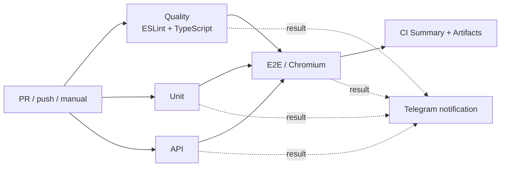

# ★★ Lesson 12 — Advanced Playwright CI Lab

[](https://github.com/TokhirjonYuldoshev/pomidorqa-course-tests/actions/workflows/playwright.yml)
[](https://github.com/TokhirjonYuldoshev/pomidorqa-course-tests/actions/workflows/stability.yml)

Личный CI-стенд для дополнительного задания ★★ Урока 12. Общий учебный репозиторий остаётся источником тестов, а здесь отдельно отрабатывается архитектура CI/CD для Playwright + TypeScript.

## Pipeline architecture



Три дешёвых независимых gate — **Quality**, **Unit** и **API** — стартуют параллельно. Дорогой E2E-job запускается только после успешного завершения всех трёх.

## Что здесь сделано

- **Quality gates:** ESLint и строгий TypeScript `tsc --noEmit`.
- **Fast feedback:** Quality, Unit и API выполняются параллельно.
- **Browser isolation:** Unit/API не устанавливают Chromium и не тратят runner-time на браузерную инфраструктуру.
- **E2E gate:** браузерные тесты стартуют только после успешных быстрых проверок.
- **Shared-stand policy:** основной CI запускает E2E с одним worker, чтобы не создавать искусственную конкуренцию за пользователей, слоты и бронирования на общем живом стенде.
- **Retry policy:** Unit/API не ретраятся; retries разрешены только E2E в CI. Отдельный stability workflow всегда работает с `retries=0`.
- **Safety:** `permissions: contents: read`, `forbidOnly` и автоматическая отмена устаревших run одного PR.
- **Deterministic install:** зависимости ставятся через `npm ci`.
- **Two-level cache:** npm cache через `setup-node`; Chromium cache привязан к OS, архитектуре runner и точной версии Playwright.
- **Correct browser cache semantics:** Linux system dependencies устанавливаются всегда, сам Chromium скачивается только при cache miss.
- **Diagnostics:** GitHub test annotations, HTML report, trace / screenshot / video на падениях и отдельный `test-results` artifact.
- **CI summary:** итог всех gates публикуется прямо в GitHub Actions Job Summary.
- **Telegram notifications:** финальный статус Quality / Unit / API / E2E отправляется в Telegram и содержит ссылку на конкретный Actions run.

## Stability workflow

Отдельный ручной `Playwright Stability Check` предназначен не для «сделать красный тест зелёным», а для поиска flaky-поведения:

- сценарий: `booking-flow` или весь E2E-suite;
- `repeat-each`: 5 или 10;
- workers: 1 или 2;
- `retries=0` — ни одно падение не маскируется повторным запуском;
- HTML report и failure diagnostics сохраняются независимо от результата.

Stability check не запускается по cron: E2E работает с общим живым стендом PomidorQA, поэтому фоновые stress-run создавали бы лишнюю нагрузку и тестовые данные.

## Telegram notifications

Job `Telegram Notification` запускается через `if: always()` и сообщает итог CI даже при падении одного из gates. Он использует напрямую официальный Telegram Bot API через `curl`, без неприкреплённого third-party GitHub Action. Ошибка Telegram API или отсутствие секретов не меняют результат тестового pipeline.

В `Settings → Secrets and variables → Actions` нужны два repository secret:

- `TELEGRAM_BOT_TOKEN` — токен бота от BotFather;
- `TELEGRAM_CHAT_ID` — ID личного чата или группы, куда бот отправляет сообщения.

Если секреты ещё не настроены, notification job завершится успешно с notice и ничего не отправит. Значения токена и chat ID не хранятся в репозитории и не должны попадать в workflow-файл.

## Основные команды

```bash
npm run lint
npm run typecheck
npm run test:unit
npm run test:api
npm run test:e2e
```

---

# PomidorQA — тесты марафона «Автоматизация на Playwright + TypeScript»

Официальный репозиторий марафона. Здесь живут эталонные автотесты на продукт
[PomidorQA](https://aiqa.su/pomidorqa) — сервис коротких встреч для QA/IT-специалистов, единственный
сквозной проект курса.

Продукт студентам доступен только как живой сайт (`aiqa.su/pomidorqa`) — исходный код самого
приложения закрыт (это часть приватного монорепозитория основного проекта AIQA). Здесь — только
автотесты и вспомогательный код для тестов.!!

## Зачем этот репозиторий

- **Читать эталонные тесты** — начиная с Урока 3 разбираем конструкции JS/TS прямо на этом коде
- **Клонировать и запускать** — начиная с Урока 5, когда в курсе появляется Git
- **Присылать pull request'ы** — начиная с Урока 5 (первый реальный PR с оптимизацией теста) и
  особенно с Урока 16 (полный путь тикет → тест → PR → зелёный CI)
- Репозиторий будет расти вместе с курсом: новые тесты, паттерны (POM/Component Object/Screenplay),
  CI-workflow (Урок 12) — всё сюда

## Хочешь прислать Pull Request?

Начиная с Урока 5 — см. [CONTRIBUTING.md](./CONTRIBUTING.md): как получить доступ, завести ветку
и открыть PR (и что будет с ним дальше).

С Урока 11 на ревью открывай [CODEX.md](./CODEX.md). Чеклист — [REVIEW.md](./REVIEW.md).
Комментарий пиши `кодекс N`, не «тут плохо».

## Установка

```bash
npm install
npx playwright install chromium
```

## Запуск тестов

```bash
npm run test:unit   # Unit — без сети и без браузера
npm run test:api    # API — HTTP-запросы к локальному мок-серверу
npm run test:e2e    # E2E — реальный браузер на живом aiqa.su/pomidorqa
npm test            # все три уровня сразу
npm run report      # открыть HTML-отчёт последнего прогона
```

По умолчанию E2E-тесты бьют в продакшен (`https://aiqa.su`). Если нужно направить на локальный
стенд — переопредели `POMIDORQA_BASE_URL`:

```bash
POMIDORQA_BASE_URL=http://localhost:3000 npx playwright test --project=e2e
```

## Структура

```
src/pyramid/       — вспомогательный код: чистые функции (unit) и локальный мок-сервер (api)
tests/unit/        — пересечение слотов по времени, форматирование времени, валидация пароля
tests/api/         — регистрация, бронирование, гонка за слот — через HTTP к локальному мок-серверу
tests/e2e/         — реальный сценарий бронирования и негативный сценарий логина в браузере
```

## Материал к Уроку 3 («Программирование с нуля через JS/TS»)

Разбираем на эфире построчно: `tests/e2e/booking-flow.spec.ts` и `tests/e2e/login-error.spec.ts`.

**Домашнее задание:** открыть `tests/e2e/booking-flow.spec.ts`, прочитать каждую строчку и
написать построчно своими словами, что делает автотест. Решение — в чат марафона.
Запускать тест не обязательно. Подробности — в описании эфира и закрепе чата.
