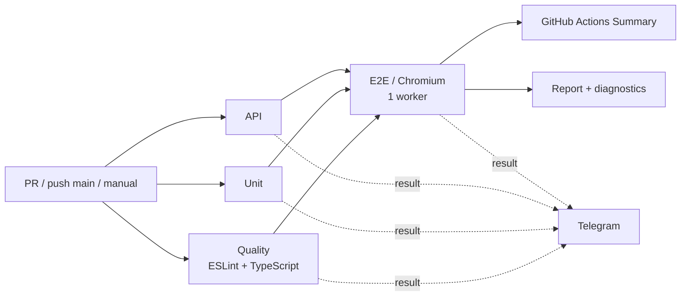

# 🍅 PomidorQA QA Automation

[](https://github.com/TokhirjonYuldoshev/pomidorqa-tests/actions/workflows/playwright.yml)
[](https://github.com/TokhirjonYuldoshev/pomidorqa-tests/actions/workflows/stability.yml)

Личный standalone-проект по QA Automation на **Playwright + TypeScript**. Он вырос из учебного репозитория PomidorQA и используется как отдельный стенд для практики E2E, API, unit-тестирования, Page Object Model, CI/CD, диагностики падений и анализа flaky-поведения.

Исходный учебный проект: [lebed52/pomidorqa-course-tests](https://github.com/lebed52/pomidorqa-course-tests).

## Что демонстрирует проект

| Область | Реализация |
| --- | --- |
| E2E | реальные пользовательские сценарии PomidorQA в Chromium |
| POM | локаторы и действия экранов вынесены в `tests/pages` |
| Helpers | регистрация, browser contexts и подготовка каталоговых данных |
| API | изолированный HTTP mock для правил бронирования и регистрации |
| Unit | чистые проверки временных диапазонов, timezone и password validation |
| Quality gate | ESLint + TypeScript `tsc --noEmit` |
| CI | отдельные Quality / Unit / API / E2E jobs |
| Diagnostics | HTML report, trace, screenshot, video, failure artifacts |
| Stability | ручной stress-run с `repeat-each` и `retries=0` |
| Notifications | Telegram Bot API с итогом pipeline |

## Архитектура тестов

```text
src/pyramid/
├── auth.ts                    # чистая логика валидации пароля
├── slots.ts                   # пересечение слотов и timezone formatting
└── mock-booking-api.ts        # локальный HTTP API для API-уровня

tests/
├── unit/
│   ├── auth.spec.ts
│   └── slots.spec.ts
├── api/
│   ├── booking-api.spec.ts
│   └── participants-api.spec.ts
├── helpers/
│   ├── user.ts                # TestUser, makeUser, registerUser, routes
│   ├── booking.ts             # browser contexts и cleanup
│   └── catalog.ts             # подготовка участников каталога
├── pages/
│   ├── auth-page.ts
│   ├── profile-page.ts
│   ├── slots-page.ts
│   └── booking-page.ts
└── e2e/
    ├── login-error.spec.ts
    ├── profile-flow.spec.ts
    ├── booking-flow.spec.ts
    ├── booking-cancel.spec.ts
    └── catalog-search.spec.ts
```

Главный принцип: **spec описывает сценарий и assertions, Page Object выполняет действия экрана, helper отвечает за повторяемую подготовку данных и контекста**.

## E2E-сценарии

Проект проверяет, в частности:

- сохранение данных профиля и навыков;
- одинаковую безопасную ошибку логина для неверного пароля и неизвестного email;
- основной booking flow;
- гонку двух пользователей за один слот;
- отмену встречи и консистентность состояния у гостя и хоста;
- поиск по уникальному навыку;
- пустую выдачу;
- исключение собственной карточки для авторизованного пользователя;
- двух участников с одинаковым навыком;
- фильтрацию подходящего/неподходящего участника;
- правило обязательного будущего свободного слота;
- повторный поиск без перезагрузки;
- поиск другим авторизованным пользователем.

Созданные browser contexts закрываются в `finally`. Тестовые пользователи и навыки получают уникальные данные на каждый запуск.

## Синхронизация и стабильность

В проекте не используются `waitForTimeout`, `force: true`, `.only`, `skip` или `page.pause()` для маскировки проблем.

Для state-changing действий используются наблюдаемые сигналы:

- HTTP response нужного POST-запроса;
- появление или исчезновение конкретного UI-состояния;
- URL/navigation events;
- polling/reload только там, где приложение реально имеет eventual consistency.

При выборе конкретной бизнес-сущности используются уникальные данные и точные локаторы. `.first()` допустим только там, где сценарий действительно выбирает первый доступный слот, а не произвольного участника.

## CI pipeline



`Quality`, `Unit` и `API` могут выполняться параллельно. Ограничение в один worker применяется только к E2E на общем live-стенде. Для E2E в обычном CI разрешены retries на уровне Playwright-конфига; отдельный stability workflow всегда запускается с `retries=0`.

Основной workflow: `.github/workflows/playwright.yml`.

## Stability Check

`.github/workflows/stability.yml` запускается вручную и предназначен не для получения «зелёного» результата любой ценой, а для поиска flaky-поведения.

Параметры:

- `booking-flow` или весь E2E-suite;
- `repeat-each`: 5 или 10;
- workers: 1 или 2;
- `retries=0`.

Если хотя бы один повтор падает, workflow завершается ошибкой и сохраняет diagnostics.

## Быстрый старт

Требования:

- Node.js 24;
- npm;
- Chromium для локального E2E.

```bash
git clone https://github.com/TokhirjonYuldoshev/pomidorqa-tests.git
cd pomidorqa-tests
npm ci
npx playwright install chromium
```

## Команды

| Команда | Назначение |
| --- | --- |
| `npm run lint` | ESLint для `src`, `tests` и Playwright config |
| `npm run typecheck` | TypeScript `tsc --noEmit` |
| `npm run test:unit` | unit-тесты |
| `npm run test:api` | API-тесты |
| `npm run test:e2e` | E2E в Chromium |
| `npm test` | все Playwright projects |
| `npm run report` | открыть последний HTML report |

По умолчанию E2E используют `https://aiqa.su`. Base URL можно переопределить:

```bash
POMIDORQA_BASE_URL=http://localhost:3000 npm run test:e2e
```

На Windows PowerShell:

```powershell
$env:POMIDORQA_BASE_URL="http://localhost:3000"
npm run test:e2e
```

## Workflow разработки

Для обычной работы используются отдельные ветки:

```text
feature/...
fix/...
refactor/...
test/...
docs/...
chore/...
```

Учебные ветки `hw<N>-<username>` сохраняются только когда этого требует курс.

Перед PR:

```bash
npm run lint
npm run typecheck
npm run test:unit
npm run test:api
npm run test:e2e
```

Подробности: [CONTRIBUTING.md](CONTRIBUTING.md), правила автотестов: [CODEX.md](CODEX.md), review checklist: [REVIEW.md](REVIEW.md).

## Зачем этот репозиторий

Цель проекта — не просто накопить автотесты, а показать воспроизводимый QA Automation workflow:

**изменение → code review → quality gates → unit/API → E2E → diagnostics → stability analysis → CI summary → notification**.

Репозиторий развивается отдельно от общего учебного `main`, поэтому архитектурные и инфраструктурные улучшения здесь можно доводить до portfolio-level состояния без расширения scope учебных PR.
