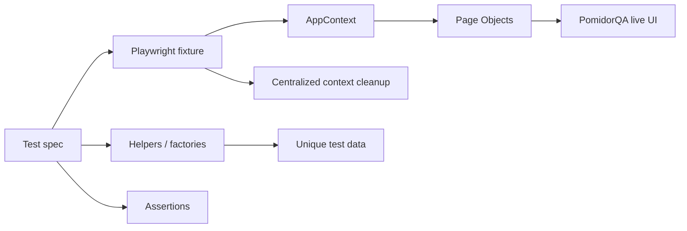
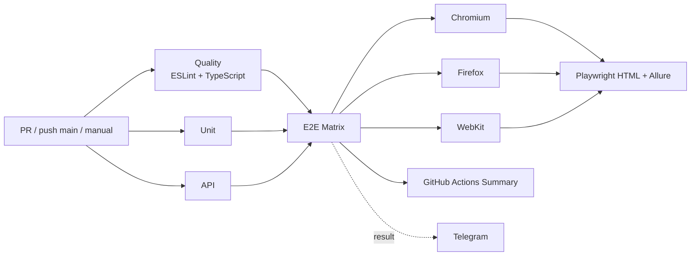

# PomidorQA QA Automation

[](https://github.com/TokhirjonYuldoshev/pomidorqa-tests/actions/workflows/playwright.yml)
[](https://github.com/TokhirjonYuldoshev/pomidorqa-tests/actions/workflows/nightly.yml)
[](https://github.com/TokhirjonYuldoshev/pomidorqa-tests/actions/workflows/security.yml)
[](https://github.com/TokhirjonYuldoshev/pomidorqa-tests/actions/workflows/stability.yml)
[](https://github.com/TokhirjonYuldoshev/pomidorqa-tests/actions/workflows/accessibility.yml)
[](https://github.com/TokhirjonYuldoshev/pomidorqa-tests/actions/workflows/performance.yml)
[](https://github.com/TokhirjonYuldoshev/pomidorqa-tests/actions/workflows/visual.yml)

Личный standalone-проект по **QA Automation на Playwright + TypeScript**. Репозиторий вырос из учебного PomidorQA-проекта и используется как отдельная площадка для практики Unit, API, E2E, Page Object Model, fixtures, test-data factories, cross-browser testing, Allure reporting, accessibility, performance smoke, visual regression, security gates, nightly regression и анализа flaky-поведения.

Исходный учебный проект: [lebed52/pomidorqa-course-tests](https://github.com/lebed52/pomidorqa-course-tests).

## Что демонстрирует проект

| Область | Реализация |
| --- | --- |
| Unit | чистые проверки password validation, slots и timezone logic |
| API | изолированный HTTP mock для booking/participants API |
| E2E | реальные пользовательские сценарии PomidorQA |
| Browser Matrix | Chromium / Firefox / WebKit через Playwright projects и `E2E_BROWSER` |
| POM | локаторы и UI actions в `tests/pages` |
| Fixtures | централизованный lifecycle browser contexts |
| Test data | уникальные run id и тестовые пользователи |
| Helpers | регистрация, catalog setup, app factory, маршруты |
| Reporting | Playwright HTML + Allure Report локально и в CI |
| Diagnostics | trace, screenshot, video и failure artifacts |
| Accessibility | axe-core WCAG audit с optional enforcement |
| Performance | Lighthouse smoke: Performance / Accessibility / Best Practices / SEO |
| Visual Regression | Chromium screenshot baseline для login/register |
| Nightly | ежедневная полная E2E-регрессия в Chromium / Firefox / WebKit |
| Security | `npm audit`, dependency-change review, ESLint + TypeScript |
| Stability | `repeat-each`, workers 1/2 и `retries=0` |
| Notifications | Telegram CI notification + отдельный diagnostic workflow |

## Testing Strategy

```text
Testing Strategy

├── Unit Tests
├── API Tests
├── E2E Tests
├── Non-functional QA
│   ├── Accessibility
│   ├── Performance Smoke
│   └── Visual Regression
└── CI / Security / Nightly Validation
```

- **Unit Tests** проверяют изолированную бизнес-логику без браузера и внешнего стенда.
- **API Tests** проверяют HTTP-контракты booking/participants на локальном mock API.
- **E2E Tests** проверяют пользовательские сценарии через Playwright на live PomidorQA UI.
- **Non-functional QA** даёт отдельный сигнал по accessibility, performance и визуальным изменениям.
- **CI / Security / Nightly** разделяют merge-validation, dependency/code-quality проверки и плановую regression-проверку live-стенда.

## Test Coverage

Covered scenarios:

- ✓ Registration
- ✓ Authentication
- ✓ Profile management
- ✓ Catalog search
- ✓ Booking creation
- ✓ Booking cancellation

Дополнительно E2E-набор проверяет:

- гонку двух пользователей за один слот;
- правила видимости карточек участников;
- обязательное наличие будущего свободного слота;
- повторный поиск без reload;
- консистентность состояния после отмены встречи.

## Архитектура тестов

```text
src/pyramid/
├── auth.ts
├── slots.ts
└── mock-booking-api.ts

tests/
├── unit/
├── api/
├── e2e/
├── fixtures/
├── helpers/
├── pages/
└── visual/

scripts/
├── accessibility-audit.mjs
└── lighthouse-summary.mjs

docs/
├── architecture.md
└── interview-guide.md

.github/workflows/
├── playwright.yml
├── nightly.yml
├── security.yml
├── stability.yml
├── accessibility.yml
├── performance.yml
├── visual.yml
└── telegram-test.yml
```

Главный принцип архитектуры:

**spec описывает сценарий и assertions → Page Object выполняет действия экрана → helper/fixture отвечает за повторяемую подготовку, данные и lifecycle контекста.**

## Поток E2E-теста



Fixtures владеют browser contexts и закрывают их централизованно после теста. `appFactory` используется, когда сценарию требуется произвольное количество изолированных пользователей; role fixtures (`hostApp`, `guestApp`, `guest2App`) делают booking-сценарии читаемыми.

## Детерминированность и flaky policy

В проекте не используются `waitForTimeout`, `force: true`, `.only`, `skip` или `page.pause()` как способ маскировать проблемы.

Для state-changing действий используются наблюдаемые сигналы:

- HTTP response нужного mutation request;
- URL/navigation transition;
- появление или исчезновение конкретного UI-состояния;
- Playwright auto-waiting;
- polling/reload только там, где подтверждена реальная eventual consistency.

Основные E2E и stability/nightly проверки работают с `retries=0`: первый реальный failure остаётся видимым сигналом.

## CI pipeline



`Quality`, `Unit` и `API` выполняются независимо. После них один и тот же E2E-suite проходит browser matrix в Chromium, Firefox и WebKit. Для browser jobs используются `workers=1`, `retries=0`, `fail-fast: false`, отдельные Playwright HTML / Allure artifacts, Summary и Telegram notification.

## Browser Matrix

Playwright config использует `E2E_BROWSER` для выбора движка:

- `chromium` — Desktop Chrome;
- `firefox` — Desktop Firefox;
- `webkit` — Desktop Safari.

Если `E2E_BROWSER` не задан, локальный E2E запускается в Chromium.

Полную matrix можно запустить через GitHub Actions или локально после установки всех трёх движков:

```bash
npx playwright install chromium firefox webkit
E2E_BROWSER=firefox npm run test:e2e
E2E_BROWSER=webkit npm run test:e2e
```

## Allure Reporting

**Allure является обычной частью проекта, а не CI-only зависимостью.** `allure-playwright` и Allure 3 CLI зафиксированы в `devDependencies`, поэтому обычного `npm ci` достаточно и для локальных запусков, и для GitHub Actions.

Playwright по умолчанию пишет результаты одновременно в Playwright HTML и `allure-results/`:

```text
Test Execution
      |
      +--> Playwright HTML
      |
      v
Allure Results
      |
      v
Allure Report
```

После любого локального запуска через Playwright можно собрать и открыть Allure Report:

```bash
npm run test:unit
npm run allure:generate
npm run allure:open
```

Аналогично это работает после API или E2E запуска. В CI основной E2E workflow, Nightly и Stability используют те же зависимости из `package-lock.json`, генерируют Allure Report и сохраняют его как GitHub Actions artifact. Отдельной `npm install --no-save` для Allure больше не требуется.

## Accessibility Audit

`.github/workflows/accessibility.yml` запускает WCAG-аудит через pinned `axe-core@4.13.0` в Chromium.

Особенности:

- отдельный `scripts/accessibility-audit.mjs`;
- отчёты сохраняются как GitHub Actions artifacts на 14 дней;
- обычный режим информационный;
- ручной `workflow_dispatch` поддерживает `enforce=true`, чтобы serious/critical нарушения становились blocking failure;
- есть отдельный weekly schedule.

Accessibility вынесен в отдельный workflow, чтобы WCAG-сигнал не смешивался с функциональными assertions.

## Performance Smoke / Lighthouse

`.github/workflows/performance.yml` выполняет desktop Lighthouse smoke для:

- `/pomidorqa` — catalog;
- `/pomidorqa/auth/login` — login;
- `/pomidorqa/auth/register` — register.

Проверяются категории:

- Performance;
- Accessibility;
- Best Practices;
- SEO.

Используется pinned `lighthouse@13.4.1`. JSON reports публикуются как artifacts. Budgets по умолчанию информационные, а ручной запуск позволяет включить enforcement.

Последний подтверждённый прогон показал:

| Page | Performance | Accessibility | Best Practices | SEO |
| --- | ---: | ---: | ---: | ---: |
| catalog | 95 | 96 | 77 | 100 |
| login | 97 | 96 | 77 | 90 |
| register | 97 | 92 | 77 | 90 |

Три findings относятся к Best Practices (`77 < 80`) и в информационном режиме не делают workflow красным.

## Visual Regression

`.github/workflows/visual.yml` использует отдельный `playwright.visual.config.ts` и `tests/visual/public-pages.visual.spec.ts`.

Текущая стратегия:

- Chromium;
- login и register;
- baseline в GitHub Actions cache, ключуемый по версии Playwright;
- первый совместимый run создаёт baseline, следующие сравнивают screenshots;
- `maxDiffPixelRatio = 0.01`;
- snapshots сохраняются как artifact на 30 дней;
- failure diagnostics сохраняются отдельно.

Это позволяет ловить визуальные изменения независимо от функциональных E2E assertions.

## Telegram Notifications & Diagnostics

Основной CI отправляет итог pipeline через Telegram Bot API.

Для отдельной диагностики интеграции есть `.github/workflows/telegram-test.yml`, который запускается вручную и проверяет:

```text
TELEGRAM_BOT_TOKEN + TELEGRAM_CHAT_ID
                |
                v
             getMe
                |
                v
             getChat
                |
                v
           sendMessage
```

Так можно отличить отсутствующий secret, неверный bot token, неправильный chat ID и реальную ошибку отправки. Значения secrets в лог не выводятся.

## Nightly Regression

`.github/workflows/nightly.yml` запускает полный E2E-suite:

- ежедневно по cron `0 23 * * *` — **23:00 UTC = 02:00 локального времени (UTC+3) следующего дня**;
- вручную через `workflow_dispatch`;
- в Chromium, Firefox и WebKit;
- с `workers=1` и `retries=0`;
- с отдельными Allure / Playwright artifacts и failure diagnostics.

Nightly отвечает за обнаружение регрессий live-стенда или внешних изменений, появившихся уже после merge.

## Security & Quality Gates

`.github/workflows/security.yml` работает независимо от основного тестового pipeline.

Gates:

- `npm audit --audit-level=high`;
- dependency-change review для `package.json` / `package-lock.json`;
- `npm ci` для lockfile consistency при изменении dependencies;
- ESLint + TypeScript как отдельный code-quality signal.

Dependency-change review не зависит от включённого GitHub Dependency Graph, поэтому workflow остаётся переносимым между репозиториями.

## Stability Check

`.github/workflows/stability.yml` запускается вручную и предназначен для исследования flaky-поведения.

Поддерживаются:

- `booking-flow` или весь E2E-suite;
- `repeat-each`: 5 или 10;
- workers: 1 или 2;
- `retries=0`;
- Playwright HTML и Allure Report artifacts.

Подтверждённая stability matrix:

| Проверка | Результат |
| --- | --- |
| `booking-flow` ×10, workers=1 | ✅ passed |
| `booking-flow` ×10, workers=2 | ✅ passed |
| весь E2E ×5, workers=1 | ✅ passed |
| весь E2E ×5, workers=2 | ✅ passed |

Run: [GitHub Actions #34267366176](https://github.com/TokhirjonYuldoshev/pomidorqa-tests/actions/runs/34267366176).

## Быстрый старт

Требования:

- Node.js 24;
- npm;
- Chromium для E2E по умолчанию.

```bash
git clone https://github.com/TokhirjonYuldoshev/pomidorqa-tests.git
cd pomidorqa-tests
npm ci
npx playwright install chromium
```

## Команды

| Команда | Назначение |
| --- | --- |
| `npm run lint` | ESLint для `src`, `tests`, `scripts` и Playwright configs |
| `npm run typecheck` | TypeScript `tsc --noEmit` |
| `npm run test:unit` | Unit tests + Allure results |
| `npm run test:api` | API tests + Allure results |
| `npm run test:e2e` | E2E в Chromium по умолчанию + Allure results; движок задаётся через `E2E_BROWSER` |
| `npm test` | Unit + API + E2E с текущим `E2E_BROWSER` |
| `npm run report` | открыть последний Playwright HTML report |
| `npm run allure:generate` | собрать `allure-report/` из `allure-results/` |
| `npm run allure:open` | открыть локально собранный Allure Report |

По умолчанию E2E используют `https://aiqa.su`. Base URL можно переопределить:

```bash
POMIDORQA_BASE_URL=http://localhost:3000 npm run test:e2e
```

На Windows PowerShell:

```powershell
$env:E2E_BROWSER="firefox"
$env:POMIDORQA_BASE_URL="http://localhost:3000"
npm run test:e2e
```

## Workflow разработки

Для обычной работы используются отдельные ветки:

```text
feature/...
fix/...
refactor/...
test/...
docs/...
chore/...
```

Перед PR:

```bash
npm run lint
npm run typecheck
npm run test:unit
npm run test:api
npm run test:e2e
```

## Документация

- [CONTRIBUTING.md](CONTRIBUTING.md) — workflow разработки;
- [CODEX.md](CODEX.md) — правила построения автотестов;
- [REVIEW.md](REVIEW.md) — review checklist;
- [docs/architecture.md](docs/architecture.md) — архитектура, CI, reporting и non-functional QA;
- [docs/interview-guide.md](docs/interview-guide.md) — готовые объяснения решений для собеседования.

## Что важно для code review

В review проверяется не только зелёный результат, но и качество сигнала теста:

- assertion находится на правильном уровне;
- locator идентифицирует нужную сущность;
- action и verification не смешиваются без необходимости;
- нет скрытых retry/sleep workaround;
- browser contexts гарантированно завершают lifecycle;
- test data независимы между запусками;
- eventual consistency обрабатывается только там, где она реально существует;
- CI не маскирует E2E failure retries.

## Зачем этот репозиторий

Цель проекта — показать не просто набор автотестов, а воспроизводимый QA Automation workflow:

**изменение → review → quality/security gates → Unit/API → E2E → reporting/diagnostics → accessibility/performance/visual checks → nightly/stability analysis → summary/notification**.

Репозиторий развивается отдельно от общего учебного `main`, поэтому архитектурные и инфраструктурные улучшения можно доводить до portfolio-level состояния, не расширяя scope учебных PR.