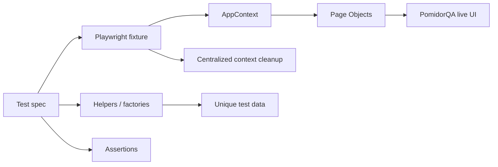
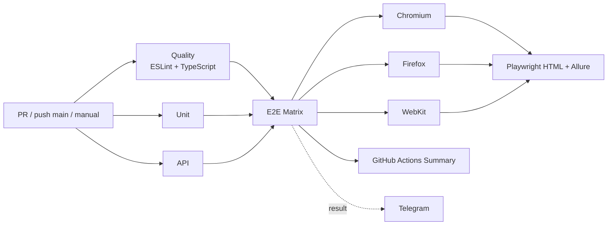

# PomidorQA QA Automation

[](https://github.com/TokhirjonYuldoshev/pomidorqa-tests/actions/workflows/playwright.yml)
[](https://github.com/TokhirjonYuldoshev/pomidorqa-tests/actions/workflows/nightly.yml)
[](https://github.com/TokhirjonYuldoshev/pomidorqa-tests/actions/workflows/security.yml)
[](https://github.com/TokhirjonYuldoshev/pomidorqa-tests/actions/workflows/stability.yml)

Личный standalone-проект по **QA Automation на Playwright + TypeScript**. Репозиторий вырос из учебного PomidorQA-проекта и используется как отдельная площадка для практики E2E, API и unit-тестирования, Page Object Model, fixtures, test-data factories, cross-browser CI, Allure reporting, диагностики падений и анализа flaky-поведения.

Исходный учебный проект: [lebed52/pomidorqa-course-tests](https://github.com/lebed52/pomidorqa-course-tests).

## Что демонстрирует проект

| Область | Реализация |
| --- | --- |
| E2E | реальные пользовательские сценарии PomidorQA; локально Chromium по умолчанию, в CI — Chromium / Firefox / WebKit |
| POM | локаторы и действия экранов в `tests/pages` |
| Fixtures | централизованное создание и teardown browser contexts |
| Test data | общий генератор уникальных run id и тестовых пользователей |
| Helpers | регистрация, подготовка каталога, app factory, маршруты |
| API | изолированный HTTP mock для booking/participants API |
| Unit | чистые проверки password validation, slots и timezone logic |
| Quality gate | ESLint + TypeScript `tsc --noEmit` |
| CI | Quality / Unit / API → E2E matrix в трёх браузерах |
| Reporting | Playwright HTML + Allure Report для каждого browser job |
| Diagnostics | trace, screenshot, video, HTML report и failure artifacts |
| Nightly | ежедневная полная E2E-регрессия в Chromium / Firefox / WebKit |
| Security | `npm audit`, dependency-change review, ESLint + TypeScript |
| Stability | stress-runs с `repeat-each`, workers 1/2 и `retries=0` |
| Notifications | Telegram Bot API с итогом pipeline |

## Testing Strategy

```text
Testing Strategy

├── Unit Tests
├── API Tests
├── E2E Tests
└── CI Validation
```

- **Unit Tests** проверяют изолированную бизнес-логику без браузера и внешнего стенда.
- **API Tests** проверяют HTTP-контракты booking/participants на локальном mock API.
- **E2E Tests** проверяют пользовательские сценарии через Playwright на live PomidorQA UI.
- **CI Validation** объединяет lint, typecheck, Unit, API и обязательный cross-browser E2E gate с `retries=0`.

## Test Coverage

Covered scenarios:

- ✓ Registration
- ✓ Authentication
- ✓ Profile management
- ✓ Catalog search
- ✓ Booking creation
- ✓ Booking cancellation

Дополнительно E2E-набор проверяет конкуренцию за один слот, правила видимости карточек участников, обязательное наличие будущего свободного слота, повторный поиск без reload и консистентность состояния после отмены встречи.

## Архитектура тестов

```text
src/pyramid/
├── auth.ts                    # чистая логика password validation
├── slots.ts                   # slots/timezone logic
└── mock-booking-api.ts        # локальный HTTP API для API-уровня

tests/
├── unit/
│   ├── auth.spec.ts
│   └── slots.spec.ts
├── api/
│   ├── booking-api.spec.ts
│   └── participants-api.spec.ts
├── fixtures/
│   └── app-fixtures.ts        # appFactory + role fixtures + teardown
├── helpers/
│   ├── routes.ts              # централизованные PomidorQA routes
│   ├── test-data.ts           # unique token / run id factory
│   ├── user.ts                # TestUser, makeUser, registerUser
│   ├── booking.ts             # AppContext, createApp, closeApps
│   └── catalog.ts             # подготовка catalog participants
├── pages/
│   ├── auth-page.ts
│   ├── profile-page.ts
│   ├── slots-page.ts
│   └── booking-page.ts
└── e2e/
    ├── login-error.spec.ts
    ├── profile-flow.spec.ts
    ├── booking-flow.spec.ts
    ├── booking-cancel.spec.ts
    └── catalog-search.spec.ts
```

Главный принцип архитектуры:

**spec описывает сценарий и assertions → Page Object выполняет действия экрана → helper/fixture отвечает за повторяемую подготовку, данные и жизненный цикл контекста.**

Подробные решения и готовые объяснения для собеседования:

- [`docs/architecture.md`](docs/architecture.md) — архитектура, lifecycle, CI, reporting и stability decisions;
- [`docs/interview-guide.md`](docs/interview-guide.md) — короткие и развёрнутые ответы на технические вопросы.

## Поток E2E-теста



Fixtures владеют browser contexts и закрывают их централизованно после теста. `appFactory` используется в сценариях, где требуется произвольное количество изолированных пользователей; role fixtures (`hostApp`, `guestApp`, `guest2App`) делают booking-сценарии читаемыми.

## E2E-сценарии

Проект проверяет, в частности:

- сохранение данных профиля и навыков;
- одинаковую безопасную ошибку логина для неверного пароля и неизвестного email;
- основной booking flow;
- гонку двух пользователей за один слот;
- отмену встречи и консистентность состояния у гостя и хоста;
- поиск по уникальному навыку;
- пустую выдачу;
- исключение собственной карточки для авторизованного пользователя;
- двух участников с одинаковым навыком;
- включение подходящего и исключение неподходящего участника;
- правило обязательного будущего свободного слота;
- повторный поиск без перезагрузки;
- поиск другим авторизованным пользователем.

Для связанных сущностей одного сценария используется общий `runId`, при этом роли (`host`, `guest`, `guest2`) остаются различимыми. Это делает данные уникальными между запусками и одновременно сохраняет сценарий читаемым.

## Детерминированность и синхронизация

В проекте не используются `waitForTimeout`, `force: true`, `.only`, `skip` или `page.pause()` для маскировки проблем.

Для state-changing действий используются наблюдаемые сигналы:

- HTTP response нужного POST-запроса;
- появление или исчезновение конкретного UI-состояния;
- URL/navigation events;
- polling/reload только там, где приложение реально имеет eventual consistency.

При выборе конкретной бизнес-сущности используются уникальные данные и точные локаторы. Для booking-сценариев, которые сами создают ровно один слот, Page Object не выбирает произвольный `.first()`: он проверяет precondition «ровно один доступный день / слот» и падает с диагностическим сообщением, если состояние неожиданно изменилось.

## Browser context lifecycle

Создание контекста вынесено в `createApp()`, а teardown — в fixtures.

Если setup падает после создания browser context, helper закрывает уже созданный context перед повторным выбросом ошибки. При общем teardown выполняется попытка закрыть все созданные contexts; ошибки cleanup не скрываются как обычные предупреждения.

Это защищает E2E-suite от скрытых browser-context leaks и делает инфраструктурные проблемы видимыми в CI.

## CI pipeline



`Quality`, `Unit` и `API` выполняются независимо. После них один и тот же E2E-suite запускается отдельными jobs в Chromium, Firefox и WebKit. Каждый browser job работает на общем live-стенде с `workers=1` и `retries=0`.

`fail-fast: false` сохраняет результат всех трёх браузеров даже при падении одного из них. Для каждого движка отдельно загружаются Playwright HTML и Allure artifacts.

Ключевое правило CI: **E2E retries = 0**. Первый реальный E2E failure делает check красным и не маскируется автоматическим retry.

Основной workflow: `.github/workflows/playwright.yml`.

## Browser Matrix

Playwright config использует `E2E_BROWSER` для выбора движка:

- `chromium` — Desktop Chrome;
- `firefox` — Desktop Firefox;
- `webkit` — Desktop Safari.

Если `E2E_BROWSER` не задан, локальный E2E запускается в Chromium. Основной CI и Nightly явно передают браузер из GitHub Actions matrix и поэтому выполняют весь E2E-suite во всех трёх движках.

## Allure Reporting

Для анализа результатов используется **Allure Report** параллельно со встроенным Playwright HTML report.

```text
Test Execution
      |
      v
Allure Results
      |
      v
Allure Report
      |
      v
GitHub Actions Artifact
```

Allure reporter включается в CI через `ALLURE_ENABLED=true`. Отчёт генерируется после browser job, сохраняется отдельным artifact для конкретного движка и остаётся доступным для failure analysis, если E2E-run завершился ошибкой и workflow не был отменён.

## Nightly Regression

`.github/workflows/nightly.yml` запускает полный E2E-suite:

- ежедневно по cron `0 23 * * *` — **23:00 UTC = 02:00 локального времени (UTC+3) следующего дня**;
- вручную через `workflow_dispatch`;
- в Chromium, Firefox и WebKit;
- с `workers=1` и `retries=0`;
- с отдельными Allure / Playwright artifacts и failure diagnostics.

Nightly не заменяет PR gate. Его задача — обнаружить регрессию live-стенда или внешнее изменение, появившееся уже после merge.

## Security & Quality Gates

`.github/workflows/security.yml` работает независимо от основного тестового pipeline.

Gates:

- `npm audit --audit-level=high` для dependency tree;
- dependency-change review для `package.json` / `package-lock.json` в pull request;
- `npm ci` для проверки lockfile consistency при изменении dependencies;
- ESLint + TypeScript как отдельный code-quality signal.

Dependency-change review не зависит от включённого GitHub Dependency Graph, поэтому workflow остаётся переносимым между репозиториями.

## Stability Check

`.github/workflows/stability.yml` запускается вручную и предназначен именно для поиска flaky-поведения.

Параметры:

- `booking-flow` или весь E2E-suite;
- `repeat-each`: 5 или 10;
- workers: 1 или 2;
- `retries=0`.

Если хотя бы один повтор падает, workflow завершается ошибкой и сохраняет diagnostics.

### Подтверждённый stability run

Перед включением строгого CI gate был выполнен отдельный stress-run без retries:

| Проверка | Результат |
| --- | --- |
| `booking-flow` ×10, workers=1 | ✅ passed |
| `booking-flow` ×10, workers=2 | ✅ passed |
| весь E2E ×5, workers=1 | ✅ passed |
| весь E2E ×5, workers=2 | ✅ passed |

Run: [GitHub Actions #34267366176](https://github.com/TokhirjonYuldoshev/pomidorqa-tests/actions/runs/34267366176).

После этого required E2E gate был переведён на `--retries=0` и также прошёл полный CI.

## Почему здесь есть `.first()` и где его нет

В проекте действует правило: нельзя использовать `.first()` как способ «как-нибудь выбрать» конкретного пользователя, карточку, meeting или другой объект, который должен быть идентифицирован однозначно.

Для booking flow сценарий сам создаёт единственный слот. Даже здесь текущая реализация не полагается на произвольный `.first()`: Page Object сначала проверяет количество доступных дней/слотов и продолжает только при значении `1`.

## Быстрый старт

Требования:

- Node.js 24;
- npm;
- Chromium для E2E по умолчанию.

```bash
git clone https://github.com/TokhirjonYuldoshev/pomidorqa-tests.git
cd pomidorqa-tests
npm ci
npx playwright install chromium
```

Чтобы локально прогонять полную browser matrix, установите все три движка:

```bash
npx playwright install chromium firefox webkit
```

## Команды

| Команда | Назначение |
| --- | --- |
| `npm run lint` | ESLint для `src`, `tests` и Playwright config |
| `npm run typecheck` | TypeScript `tsc --noEmit` |
| `npm run test:unit` | unit-тесты |
| `npm run test:api` | API-тесты |
| `npm run test:e2e` | E2E в Chromium по умолчанию; движок задаётся через `E2E_BROWSER` |
| `npm test` | Unit + API + E2E с текущим `E2E_BROWSER` |
| `npm run report` | открыть последний Playwright HTML report |

Примеры cross-browser запуска:

```bash
E2E_BROWSER=firefox npm run test:e2e
E2E_BROWSER=webkit npm run test:e2e
```

По умолчанию E2E используют `https://aiqa.su`. Base URL можно переопределить:

```bash
POMIDORQA_BASE_URL=http://localhost:3000 npm run test:e2e
```

На Windows PowerShell:

```powershell
$env:E2E_BROWSER="firefox"
$env:POMIDORQA_BASE_URL="http://localhost:3000"
npm run test:e2e
```

## Workflow разработки

Для обычной работы используются отдельные ветки:

```text
feature/...
fix/...
refactor/...
test/...
docs/...
chore/...
```

Учебные ветки `hw<N>-<username>` сохраняются только когда этого требует курс.

Перед PR:

```bash
npm run lint
npm run typecheck
npm run test:unit
npm run test:api
npm run test:e2e
```

Полная cross-browser проверка выполняется CI matrix после открытия PR.

Подробности:

- [CONTRIBUTING.md](CONTRIBUTING.md) — workflow разработки;
- [CODEX.md](CODEX.md) — правила построения автотестов;
- [REVIEW.md](REVIEW.md) — review checklist;
- [docs/architecture.md](docs/architecture.md) — архитектурные решения;
- [docs/interview-guide.md](docs/interview-guide.md) — interview preparation layer.

## Что важно для code review

В review проверяется не только зелёный результат, но и качество сигнала теста:

- assertion находится на правильном уровне;
- locator идентифицирует нужную сущность;
- action и verification не смешиваются без необходимости;
- нет скрытых retry/sleep workaround;
- browser contexts гарантированно завершают lifecycle;
- test data независимы между запусками;
- eventual consistency обрабатывается только там, где она реально существует;
- CI не маскирует E2E failure retries.

## Зачем этот репозиторий

Цель проекта — показать не просто набор автотестов, а воспроизводимый QA Automation workflow:

**изменение → review → quality/security gates → unit/API → cross-browser E2E → Allure/diagnostics → nightly/stability analysis → summary/notification**.

Репозиторий развивается отдельно от общего учебного `main`, поэтому архитектурные и инфраструктурные улучшения можно доводить до portfolio-level состояния, не расширяя scope учебных PR.