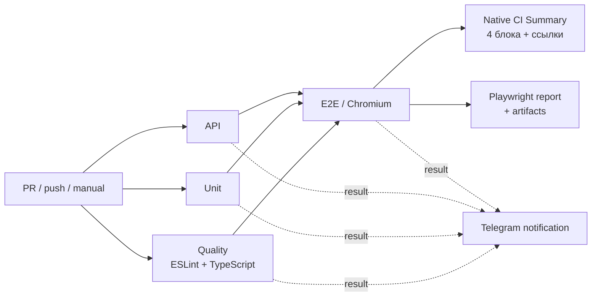

# 🍅 PomidorQA Playwright CI Lab

[](https://github.com/TokhirjonYuldoshev/pomidorqa-course-tests/actions/workflows/playwright.yml)
[](https://github.com/TokhirjonYuldoshev/pomidorqa-course-tests/actions/workflows/stability.yml)

Личный учебный CI/CD-стенд на **Playwright + TypeScript**. Здесь я отрабатываю не только написание автотестов, но и инженерную часть вокруг них: quality gates, изоляцию уровней тестирования, стабильность E2E, диагностику падений, защиту `main`, нативный GitHub Actions Summary и уведомления о результате pipeline в Telegram.

Проект основан на учебном репозитории марафона [lebed52/pomidorqa-course-tests](https://github.com/lebed52/pomidorqa-course-tests). В этом репозитории находятся мои отдельные CI-эксперименты и улучшения, которые не смешиваются с общим учебным `main`.

## Что реализовано

| Область | Реализация |
| --- | --- |
| Quality gate | ESLint + TypeScript `tsc --noEmit` |
| Unit | отдельный job без установки Chromium |
| API | отдельный job без установки Chromium |
| E2E | Chromium, запуск только после успешных Quality / Unit / API |
| CI cache | npm cache + cache Chromium по OS, arch и версии Playwright |
| Diagnostics | HTML report, trace, screenshot, video и failure artifacts |
| CI Summary | нативный GitHub Actions Summary с 4 блоками, статусами, окружением и ссылками |
| Stability | ручной stress-run с `repeat-each`, workers и `retries=0` |
| Notifications | Telegram Bot API с итогом каждого CI run |
| Main protection | PR-only, required checks, squash-only, linear history, без force-push/delete |

## Архитектура pipeline



`Quality`, `Unit` и `API` стартуют параллельно. Более дорогой E2E-job запускается только после прохождения всех трёх быстрых gates. Это сокращает лишнее использование runner-time, если проблема уже найдена на раннем этапе.

## Advanced Playwright CI

Основной workflow: `.github/workflows/playwright.yml`.

Он запускается на:

- Pull Request в `main`;
- push в `main`;
- ручной `workflow_dispatch`.

Ключевые решения:

- Node.js 24;
- зависимости устанавливаются через `npm ci`;
- Unit/API не устанавливают браузер;
- E2E использует один worker на общем live-стенде;
- E2E может использовать до двух retries в обычном CI;
- `forbidOnly` включён в CI;
- Chromium скачивается только при cache miss, системные зависимости устанавливаются всегда;
- HTML-отчёт сохраняется после E2E;
- trace / screenshot / video сохраняются на падениях;
- устаревшие runs одного PR автоматически отменяются через `concurrency`;
- итог публикуется в нативном GitHub Actions Job Summary.

## GitHub Actions Summary

После завершения pipeline job `CI Summary` собирает результаты Quality / Unit / API / E2E и публикует их прямо на странице запуска — без отдельного dashboard workflow и без дополнительных SVG/HTML artifacts.

Summary организован как компактная сетка **2×2**:

| Слева | Справа |
| --- | --- |
| **📋 1. Проверки качества** — ESLint + TypeScript, Unit, API, E2E | **✈️ 2. Telegram** — бот, уведомления, содержимое и ссылка на run |
| **⚙️ 3. Окружение** — Node.js, workers, retries, cache, browser, report | **🚀 4. Запуск** — репозиторий, ветка, событие, автор, commit и run |

В верхней части Summary остаются быстрые переходы на:

- текущий GitHub Actions run;
- Playwright artifacts;
- [@Tokhirjon_QA_Bot](https://t.me/Tokhirjon_QA_Bot).

Дополнительно есть сворачиваемый технический блок с raw-статусами jobs и состоянием browser cache.

## Stability Check

Отдельный workflow `.github/workflows/stability.yml` используется для поиска flaky-поведения, а не для маскировки падений retries.

Параметры ручного запуска:

- сценарий: `booking-flow` или весь E2E-suite;
- `repeat-each`: 5 или 10;
- workers: 1 или 2;
- `retries=0` всегда.

### Реальный stability-эксперимент

На `booking-flow.spec.ts` была воспроизводимая нестабильность в переходе `slot click → booking dialog`.

| Этап | Passed | Failed |
| --- | ---: | ---: |
| Baseline до исправления | 2 / 20 | 18 / 20 |
| После исправления в PR-ветке | 10 / 10 | 0 / 10 |
| После squash-merge в `main` | 10 / 10 | 0 / 10 |

Исправление было сделано через детерминированную UI-синхронизацию: `waitForURL`, ожидание готовности конкретного UI, выбор точного слота, поиск встречи по участнику и гарантированный cleanup browser contexts.

Вариант с `networkidle` был отклонён quality gate правилом `playwright/no-networkidle`; lint не отключался. В тест также не добавлялись `waitForTimeout`, `force` или дополнительные retries.

> Результат 10/10 не доказывает абсолютное отсутствие flake во всех условиях, но ранее стабильно воспроизводимая проблема не повторилась после исправления ни в PR-ветке, ни после merge в `main`.

## Telegram-уведомления

После завершения pipeline отдельный job отправляет результат через официальный **Telegram Bot API** напрямую с помощью `curl`.

Пример сообщения:

```text
🍅 PomidorQA CI
✅ ВСЕ ПРОВЕРКИ ПРОЙДЕНЫ

📦 Репозиторий: TokhirjonYuldoshev/pomidorqa-course-tests
🌿 Ветка: main
⚡ Событие: Push в репозиторий

📋 Результаты проверок
✅ Успешно — Линт и типизация
✅ Успешно — Unit tests
✅ Успешно — API tests
✅ Успешно — E2E / Chromium

🔗 Открыть запуск в GitHub Actions
```

Для отправки используются repository secrets:

- `TELEGRAM_BOT_TOKEN`;
- `TELEGRAM_CHAT_ID`.

Секреты не хранятся в репозитории. Если они не настроены, notification job безопасно завершится без отправки. Ошибка Telegram API также не делает основной тестовый pipeline красным.

## Защита `main`

`main` защищён ruleset-ом. Для изменения основной ветки требуется Pull Request и прохождение обязательных checks:

- `Quality / lint + typecheck`;
- `Unit tests`;
- `API tests`;
- `E2E / Chromium`.

Дополнительно включены:

- branch must be up to date before merge;
- conversation resolution before merge;
- squash merge only;
- linear history;
- запрет force push;
- запрет удаления `main`.

## Быстрый старт

Требования:

- Node.js 24;
- npm;
- Chromium для локального E2E.

```bash
git clone https://github.com/TokhirjonYuldoshev/pomidorqa-course-tests.git
cd pomidorqa-course-tests
npm ci
npx playwright install chromium
```

## Основные команды

| Команда | Назначение |
| --- | --- |
| `npm run lint` | ESLint для тестового кода |
| `npm run typecheck` | TypeScript `tsc --noEmit` |
| `npm run test:unit` | Unit-тесты |
| `npm run test:api` | API-тесты |
| `npm run test:e2e` | E2E-тесты в Chromium |
| `npm test` | все Playwright projects |
| `npm run report` | открыть последний HTML report |

По умолчанию E2E работают с `https://aiqa.su`. Для другого стенда можно переопределить base URL:

```bash
POMIDORQA_BASE_URL=http://localhost:3000 npm run test:e2e
```

## Структура проекта

```text
.github/workflows/
├── playwright.yml        # основной CI pipeline + native Summary + Telegram
└── stability.yml         # ручной stability / flake check

src/pyramid/              # вспомогательный код unit/API уровня
tests/unit/               # unit tests
tests/api/                # API tests
tests/e2e/                # browser E2E tests
playwright.config.ts       # projects, retries, reporters, diagnostics
eslint.config.mjs          # quality rules for Playwright tests
```

## Что этот репозиторий демонстрирует

Для меня этот проект — не просто набор автотестов. Он показывает полный QA automation workflow:

**изменение → Pull Request → quality gates → E2E → native CI Summary + artifacts → stability analysis → защищённый merge → уведомление в Telegram**.

Цель стенда — практиковать подход, близкий к рабочему процессу AQA/QA Automation Engineer, и фиксировать инженерные решения так, чтобы их можно было объяснить на code review или собеседовании.
