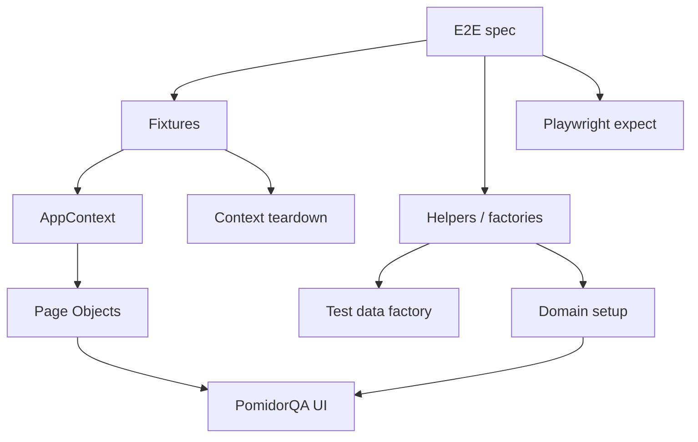
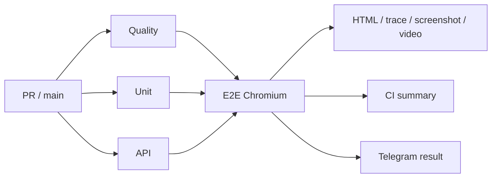

# PomidorQA QA Automation Architecture

Этот документ фиксирует архитектурные решения standalone QA Automation-проекта и объясняет, почему тестовая инфраструктура устроена именно так.

## Цели

Архитектура должна обеспечивать:

1. независимость E2E-сценариев;
2. однозначные locators и test data;
3. отсутствие скрытых sleep/retry workaround;
4. централизованный browser-context lifecycle;
5. разделение scenario, actions, assertions и setup;
6. воспроизводимую диагностику CI failures;
7. возможность отдельно stress-тестировать flaky-поведение.

## Architecture at a glance

```text
Tests
 |
 ├── E2E scenarios
 |
 ├── Page Objects
 |
 ├── Fixtures
 |
 ├── Helpers
 |
 └── Test Data Factories
```

E2E-сценарии описывают бизнес-поведение и assertions. Page Objects инкапсулируют взаимодействие с UI, fixtures управляют browser contexts, helpers отвечают за повторяемую подготовку, а test-data factories создают независимые уникальные данные для каждого запуска.

## Слои



### `tests/e2e`

Отвечает за бизнес-сценарий:

- шаги пользователя;
- `test.step`;
- assertions;
- выбор того, какие fixtures/helpers нужны сценарию.

Spec не должен владеть ручным lifecycle browser context и не должен дублировать повторяемый setup.

### `tests/pages`

Page Objects инкапсулируют:

- locators;
- UI actions;
- синхронизацию действия с наблюдаемым UI/network signal.

Assertions бизнес-результата остаются в spec. Page Object может валидировать технический precondition действия, если без него действие становится неоднозначным. Например, booking flow, который создаёт ровно один слот, проверяет, что доступен действительно один день и один slot button.

### `tests/fixtures`

`app-fixtures.ts` владеет lifecycle browser contexts.

`appFactory` создаёт произвольное количество независимых `AppContext` внутри теста. Role fixtures (`hostApp`, `guestApp`, `guest2App`) дают читаемый интерфейс booking-сценариям.

Все созданные через factory contexts регистрируются для teardown.

### `tests/helpers`

Helpers разделены по ответственности:

- `routes.ts` — маршруты PomidorQA;
- `test-data.ts` — уникальные tokens/run ids;
- `user.ts` — `TestUser`, создание пользователя, регистрация;
- `booking.ts` — `AppContext`, создание и закрытие app contexts;
- `catalog.ts` — domain setup каталога.

Маршруты не принадлежат user-helper, а генерация уникальных данных не принадлежит catalog-helper. Это уменьшает скрытую связанность между слоями.

## Test data

Каждый сценарий получает уникальный `runId`.

Связанные сущности одного сценария используют общий run id:

```text
booking-flow-<unique>
host + runId
guest + runId
guest2 + runId
skill + runId
```

Плюсы:

- данные не конфликтуют между параллельными/повторными запусками;
- связанные сущности легко сопоставить в логах;
- имя пользователя не получает несколько вложенных случайных suffix;
- сценарий остаётся читаемым.

## Browser context lifecycle

`createApp()` создаёт `BrowserContext`, затем `Page` и Page Objects.

Если setup падает после создания context, context закрывается до повторного выброса исходной ошибки.

При teardown `closeApps()` пытается закрыть все зарегистрированные contexts. Cleanup failure не превращается в тихий `console.warn`: ошибка должна быть видимой, потому что утечка context — инфраструктурная проблема теста.

## Синхронизация

Запрещённые способы стабилизации:

- `waitForTimeout`;
- `force: true`;
- `.only`;
- `skip`;
- `page.pause()`;
- CI retries для превращения красного E2E в зелёный.

Используемые сигналы:

- URL transition;
- HTTP response конкретного mutation request;
- появление/исчезновение конкретного элемента;
- Playwright auto-waiting;
- polling/reload только для подтверждённой eventual consistency.

## Booking slot semantics

Booking tests сами создают единственный future slot для уникального host.

Поэтому действие называется `pickOnlyAvailableSlot()`, а не `pickFirstSlot()`.

Перед выбором Page Object проверяет:

1. доступен ровно один день со слотами;
2. после выбора дня доступен ровно один slot button.

Если приложение показывает другое состояние, тест падает с диагностикой вместо выбора произвольного `.first()`.

## CI

Основной pipeline:



Required E2E gate выполняется с:

```text
workers=1
retries=0
```

Один worker выбран из-за общего live-стенда. Ноль retries нужен, чтобы первый реальный failure оставался красным сигналом.

## Stability workflow

Отдельный workflow не является required gate. Его задача — исследование стабильности.

Поддерживаются:

- `repeat-each=5/10`;
- workers `1/2`;
- `retries=0`;
- booking-flow или весь E2E suite;
- HTML report и failure diagnostics.

Перед включением strict CI gate была подтверждена матрица:

| Target | Repeats | Workers | Result |
| --- | ---: | ---: | --- |
| booking-flow | 10 | 1 | passed |
| booking-flow | 10 | 2 | passed |
| all E2E | 5 | 1 | passed |
| all E2E | 5 | 2 | passed |

GitHub Actions run: `34267366176`.

## Review policy

При code review приоритеты такие:

1. BLOCKER — тест не проверяет требование, ломает suite или создаёт опасную ложную зелень;
2. MAJOR — нестабильная/неоднозначная идентификация сущности, leak, зависимость между тестами, скрытый retry/sleep;
3. MINOR — архитектурный долг, который не ломает сигнал сейчас;
4. NIT — косметика без влияния на корректность.

Главная цель review — качество тестового сигнала, а не количество комментариев.
